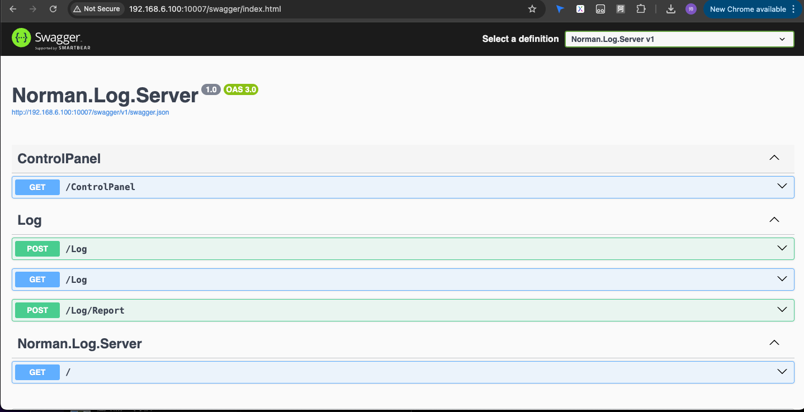

# 说明

该项目主要提供:

* 提供接收日志的接口,使用WebSocket/gRPC/命名管道
* 提供推送给各个端的接口,使用WebSocket/gRPC/命名管道
* 提供查询日志的接口,通过HTTP接口
* 提供类似于文件写入器的缓存内核,用于降低IO压力,异步写入日志(到文件/数据库),异步推送日志
* 用于状态监控/控制面板的接口,通过WebSocket提供

部署中遇到ip addr show dev docker0的状态始终显示为DOWN
各种启动啊,修改配置啥的全都不管用.
后来关闭了softether client以后,重新使用AccountConnect xxx连上了以后, vpn的ip, route全都没有了 手动设置了以后才可以

然后进入到测试容器中curl就能访问外网了.也不知道是什么问题.

可以了以后就构建该镜像,构建完了以后:

norman@norman-ThinkPad-S3-S440:/tmp/norman.log.server.dev/Norman.Log/Norman.Log.Server$ docker run norman.log.server
You must install or update .NET to run this application.

App: /app/Norman.Log.Server.dll
Architecture: x64
Framework: 'Microsoft.AspNetCore.App', version '7.0.0' (x64)
.NET location: /usr/share/dotnet/

No frameworks were found.

Learn about framework resolution:
https://aka.ms/dotnet/app-launch-failed

To install missing framework, download:
https://aka.ms/dotnet-core-applaunch?framework=Microsoft.AspNetCore.App&framework_version=7.0.0&arch=x64&rid=debian.11-x64

我尼玛!, 为啥? 
因为 FROM mcr.microsoft.com/dotnet/runtime:7.0 AS base是错误的
要用FROM mcr.microsoft.com/dotnet/aspnet:7.0 AS base

